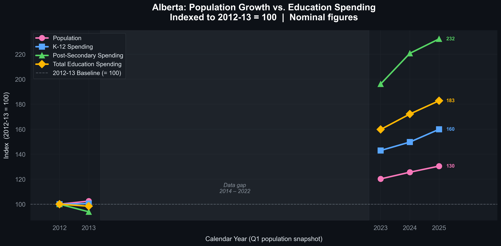
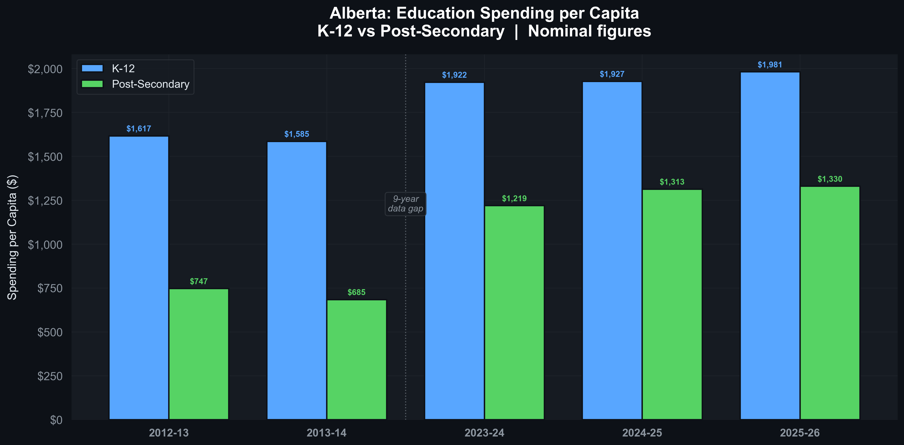
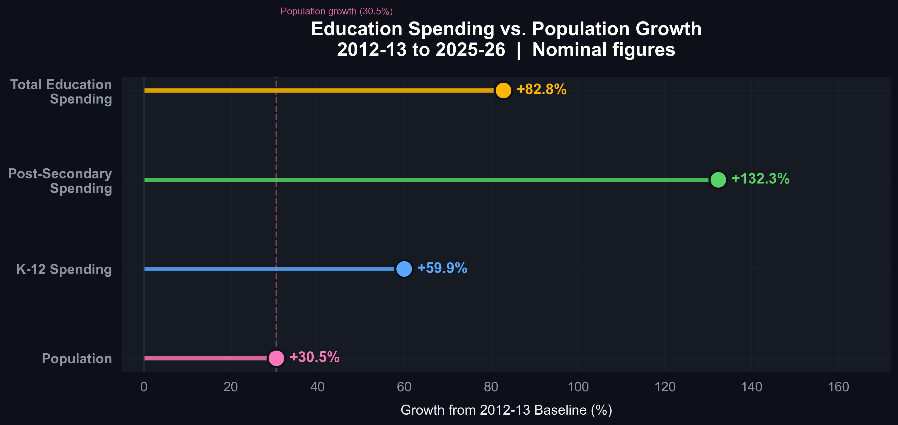
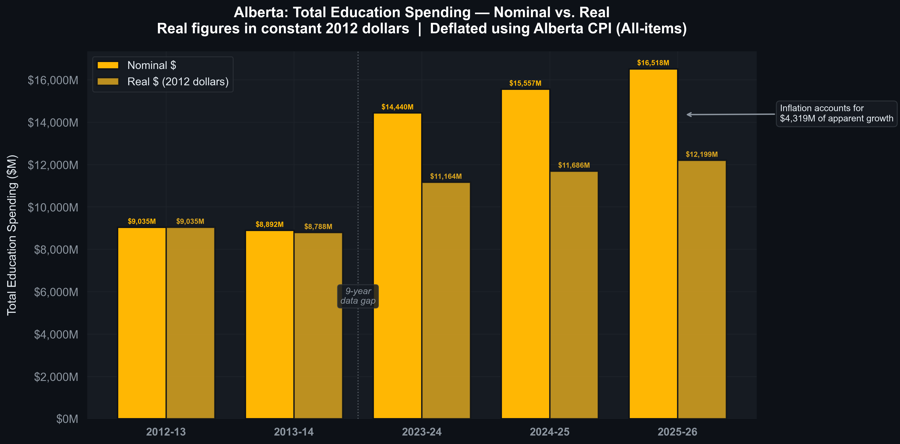
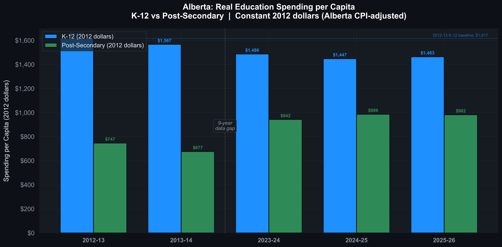
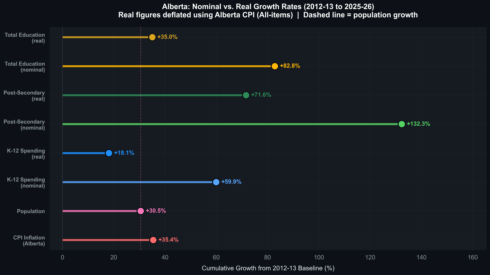
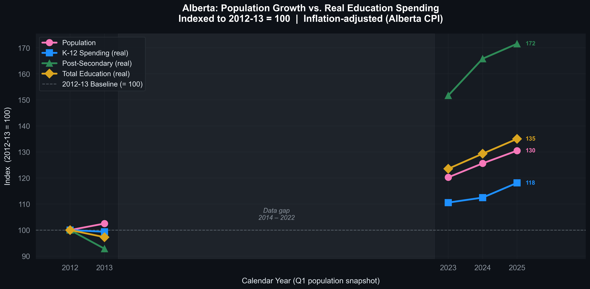
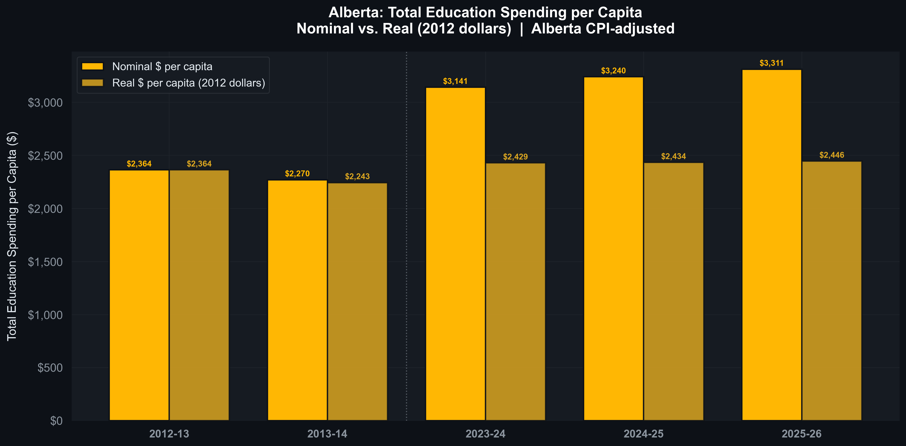

# Alberta Population & Education Spending Analysis (2012-2025)

## Executive Summary

This report examines the relationship between Alberta's population growth and provincial education spending across 13 fiscal years (2012-13 to 2025-26), drawing on quarterly population estimates from Statistics Canada and ministry-level operating expenditure extracted from official Alberta Budget Fiscal Plans. A consumer price index (CPI) adjustment using Alberta-specific inflation data provides the first real-dollar assessment of education investment over this period.

Over this period, Alberta's population grew from 3,822,425 to 4,988,181 -- an increase of 30.5%, adding over 1.1 million residents. Total education operating expense (K-12 and post-secondary combined) rose from $9,035 million to $16,518 million -- a nominal increase of 82.8%. In nominal terms, education spending grew at approximately **2.7 times the rate of population growth**.

However, after adjusting for Alberta's cumulative CPI inflation of 35.4% over the same period, the picture changes substantially:

- **Total real education spending** grew by 35.0% -- still exceeding population growth, but roughly half the nominal headline figure.
- **Real per-capita education spending** rose by just 3.5% over 13 years -- from $2,364 to $2,446 in constant 2012 dollars -- effectively flat.
- **K-12 real per-capita spending declined by 9.5%**, falling from $1,617 to $1,463 in 2012 dollars. This represents an erosion of per-person K-12 investment in real terms despite the nominal increase.
- **Post-secondary real per-capita spending** rose by 31.5%, representing a genuine and substantial increase in per-person investment even after controlling for inflation and population growth.

The per-sector breakdown reveals an important structural shift: post-secondary spending grew by 132.3% nominally (71.6% in real terms) -- substantially outpacing K-12's nominal growth of 59.9% (18.1% real). Post-secondary's share of the total education budget rose from approximately 32% to 40%.

> **Note on data:** Figures for fiscal year 2025-26 are budget estimates. Intermediate years (2014-2022) are not available in this dataset; trends within that decade cannot be observed from this data alone. CPI adjustment uses Alberta All-Items CPI from Statistics Canada Table 18-10-0005-01.

---

## Table of Contents

1. [Background and Objective](#1-background-and-objective)
2. [Summary of Findings](#2-summary-of-findings)
3. [Population Growth Analysis (2012-2025)](#3-population-growth-analysis-2012-2025)
4. [Education Spending Analysis (2012-2026)](#4-education-spending-analysis-2012-2026)
5. [Population vs. Education Spending -- Integration](#5-population-vs-education-spending----integration)
6. [Inflation-Adjusted (Real-Dollar) Analysis](#6-inflation-adjusted-real-dollar-analysis)
7. [Data Sources and Methodology](#7-data-sources-and-methodology)
8. [Limitations and Caveats](#8-limitations-and-caveats)
9. [Recommendations for Further Analysis](#9-recommendations-for-further-analysis)
10. [Technical Appendix](#10-technical-appendix)

---

## 1. Background and Objective

Alberta has experienced one of the fastest rates of population growth among Canadian provinces over the past decade, driven by strong interprovincial and international migration. This demographic expansion places direct pressure on public services -- including the education system -- raising the question of whether government spending has kept pace with a growing population.

This report addresses that question with respect to education spending specifically, using publicly available data from three sources:

- **Population data:** Statistics Canada Table 17-10-0009-01, providing quarterly estimates of Alberta's population from 1946 to the present.
- **Spending data:** Alberta Budget Fiscal Plans, providing ministry-level operating expenditure for fiscal years 2012-13, 2013-14, 2023-24, 2024-25, and 2025-26.
- **Inflation data:** Statistics Canada Table 18-10-0005-01, providing Alberta All-Items CPI annual averages (2002=100), retrieved via the Alberta Economic Dashboard API.

The central objective is to determine whether Alberta's education spending grew proportionally to, faster than, or slower than its population between 2012 and 2025 -- and to examine how the K-12 and post-secondary sectors compare in this regard. The analysis presents both nominal and inflation-adjusted (real) figures to distinguish genuine investment growth from price-level effects.

---

## 2. Summary of Findings

### Table 1: Key Indicators, 2012-13 to 2025-26 (Nominal)

| Indicator | 2012-13 / Q1 2012 | 2025-26 / Q1 2025 | Nominal Change |
|---|---|---|---|
| Alberta Population | 3,822,425 | 4,988,181 | **+30.5%** |
| K-12 Operating Expense | $6,179M | $9,883M | **+59.9%** |
| Post-Secondary Operating Expense | $2,856M | $6,635M | **+132.3%** |
| Total Education Expense | $9,035M | $16,518M | **+82.8%** |
| Education Spending per Capita | ~$2,364 | ~$3,311 | **+40.1%** |
| Alberta CPI (All-Items, 2002=100) | 127.1 | 172.1 | **+35.4%** |

### Table 2: Per-Capita Education Spending (Nominal)

| Sector | 2012-13 | 2025-26 | Nominal Change |
|---|---|---|---|
| K-12 per Capita | $1,617 | $1,981 | **+22.6%** |
| Post-Secondary per Capita | $747 | $1,330 | **+78.0%** |
| Total Education per Capita | $2,364 | $3,311 | **+40.1%** |

### Table 3: Per-Capita Education Spending (Real, Constant 2012 Dollars)

| Sector | 2012-13 | 2025-26 (2012 $) | Real Change |
|---|---|---|---|
| K-12 per Capita | $1,617 | $1,463 | **-9.5%** |
| Post-Secondary per Capita | $747 | $982 | **+31.5%** |
| Total Education per Capita | $2,364 | $2,446 | **+3.5%** |

### Table 4: Nominal vs. Real Growth Comparison

| Metric | Nominal Growth | Real Growth | Difference (inflation) |
|---|---|---|---|
| K-12 Spending | +59.9% | +18.1% | 41.8 pp |
| Post-Secondary Spending | +132.3% | +71.6% | 60.7 pp |
| Total Education Spending | +82.8% | +35.0% | 47.8 pp |
| Alberta CPI Inflation | +35.4% | -- | -- |
| Alberta Population | +30.5% | -- | -- |

### Key Observations

1. **Nominal education spending substantially outpaced population growth.** Total education spending grew at 82.8% nominally -- nearly 2.7 times the 30.5% population growth rate.

2. **After inflation, the picture changes significantly.** Real total education spending grew by 35.0%, which still exceeds population growth of 30.5%, but the margin narrows to a 1.15:1 ratio -- far more modest than the 2.7:1 nominal headline.

3. **K-12 real per-capita spending declined.** This is the most significant finding of this analysis. K-12 per-capita spending rose 22.6% in nominal terms, but fell 9.5% in real terms. Each Albertan now has less K-12 purchasing power attributed to them in 2025-26 than in 2012-13, once inflation is accounted for.

4. **Post-secondary is the primary driver of real growth.** At 71.6% real growth and +31.5% real per-capita growth, post-secondary spending represents a genuine increase in investment even after controlling for both inflation and population growth. Its share of the education budget rose from approximately 32% to 40%.

5. **Total real per-capita education spending is essentially flat.** At +3.5% over 13 years, total real per-capita education spending barely changed -- the appearance of a 40.1% increase is almost entirely explained by inflation.

6. **Alberta's population growth itself was exceptional.** The province added over 1.1 million people between 2012 and 2025 -- a 30.5% increase -- with the fastest growth occurring in 2022-2024, when quarterly rates exceeded 1% per quarter.

---

## 3. Population Growth Analysis (2012-2025)

**Source notebook:** `Population Predictions Canada 2025.ipynb`

This section examines Alberta's population growth using quarterly estimates from Statistics Canada, covering the period from Q1 2012 to Q1 2025.

---

### Figure 1: Alberta Population Growth (2012-2025)


Figure 1 presents Alberta's total population as a time series from Q1 2012 to Q1 2025. The trend reveals consistent upward growth throughout the full 13-year period, with a pronounced acceleration beginning in 2022. The province's population reached 4,988,181 by Q1 2025 -- approaching 5 million residents for the first time in provincial history.

The acceleration from 2022 onward is the most significant feature of this chart. Unlike the gradual, relatively linear growth of the 2012-2019 period, the post-pandemic phase saw a surge in interprovincial and international migration, compressing into two years the equivalent of several prior years of growth.

---

### Figure 2: Quarterly Population Growth Rate (2012-2025)


Figure 2 displays the quarter-over-quarter percentage change in Alberta's population for each quarter from 2012 to 2025. The dashed line represents the long-run average quarterly growth rate of approximately 0.51%.

Three distinct phases are visible:

- **2012-2019:** Moderate, relatively consistent growth tracking close to the long-run average, with some variability tied to commodity price cycles.
- **2020 (COVID-19 impact):** A sharp deceleration, with Q3 2020 recording the lowest quarterly growth rate in the dataset at just 0.046% -- essentially zero net growth.
- **2022-2024 (post-pandemic surge):** A significant acceleration, with multiple quarters exceeding 1.0% growth -- more than double the historical average. Q4 2023 recorded the peak quarterly growth rate of 1.356%.

---

### Figure 3: Alberta's Share of Canada's Total Population (1951-2025)


Figure 3 places Alberta's growth in national context, tracking the province's share of Canada's total population from 1951 to 2025. Alberta's share has risen from 6.7% in 1951 to 12.1% in 2025 -- a near-doubling of its relative demographic weight within Confederation over 74 years.

The trend has been consistently upward, with only minor interruptions during periods of economic contraction. The steepest segment of the curve coincides with the post-2020 period, reflecting the recent migration surge. At 12.1%, Alberta now accounts for approximately one in eight Canadians.

---

### Figure 4: Year-over-Year Growth Analysis


Figure 4 presents a two-panel chart using Q1 (January) data to enable clean year-over-year comparisons. The upper panel shows the absolute change in population from one January to the next; the lower panel shows the corresponding year-over-year percentage growth rate. The chart extends back to approximately 1990 to provide longer-term historical context.

By using annual snapshots rather than quarterly data, this view smooths out intra-year fluctuations and reveals long-run structural trends more clearly. The 2022-2024 bars are the most prominent feature: absolute year-over-year gains of approximately 150,000-180,000 people in successive years represent historically anomalous growth -- more than three times the gains recorded in the moderate years of 2016-2019.

---

## 4. Education Spending Analysis (2012-2026)

This section examines Alberta's K-12 and post-secondary operating expenditures across five budget years: 2012-13, 2013-14, 2023-24, 2024-25, and 2025-26. All figures are nominal operating expenses in millions of Canadian dollars.

### Table 5: Education Operating Expenditure by Budget Year

| Budget Year | Fiscal Year | K-12 ($M) | Post-Secondary ($M) | Total ($M) |
|---|---|---|---|---|
| Budget 2012 | 2012-13 | 6,179 | 2,856 | 9,035 |
| Budget 2013 | 2013-14 | 6,210 | 2,682 | 8,892 |
| Budget 2023 | 2023-24 | 8,836 | 5,604 | 14,440 |
| Budget 2024 | 2024-25 | 9,252 | 6,305 | 15,557 |
| Budget 2025 | 2025-26 | 9,883 | 6,635 | 16,518 |

---

### Figure 5: Total Education Spending by Budget Year


Figure 5 presents total education operating expenditure as a stacked horizontal bar chart, with K-12 and post-secondary spending shown as distinct segments. Total spending grew from $9,035M (Budget 2012) to $16,518M (Budget 2025) -- an 83% nominal increase.

The most significant observation is the step-change between the 2013 and 2023 budget years. Spending was essentially flat between the two early budgets ($9,035M to $8,892M), before surging to $14,440M by Budget 2023 -- a 62% jump across the sampled gap. The dataset does not contain the intervening fiscal years (2014-2022), so the timing and trajectory of this increase within that decade cannot be determined from this data alone.

---

### Figure 6: K-12 vs Post-Secondary Operating Expenditure


Figure 6 places K-12 and post-secondary spending side by side across all five budget years, making the divergence in growth rates immediately visible.

In 2012, post-secondary spending ($2,856M) was less than half of K-12 ($6,179M). By 2025, post-secondary ($6,635M) is approaching two-thirds of K-12 ($9,883M). This convergence reflects the substantially higher growth rate of post-secondary (132.3%) versus K-12 (59.9%). At current trajectories, the funding gap between the two sectors will continue to narrow.

---

### Figure 7: K-12 vs Post-Secondary Share by Budget Year


Figure 7 presents donut charts showing the proportional split between K-12 and post-secondary spending within total education expenditure. This view isolates the structural composition of the education budget from its absolute size.

In 2012 and 2013, post-secondary represented approximately 31-32% of total education spending. By 2023-2025, that share climbed to 38-40%. This sustained shift reflects a consistent policy direction of increasing investment in colleges and universities at a faster rate than the K-12 system across multiple budget cycles.

---

### Figure 8: Education Spending Growth, 2012 to 2025


Figure 8 directly compares Budget 2012 and Budget 2025 spending side by side for each spending category, annotated with the percentage change. This single chart distills the full 13-year trend into one reference figure.

| Category | 2012-13 | 2025-26 | Nominal Change |
|---|---|---|---|
| K-12 | $6,179M | $9,883M | **+60%** |
| Post-Secondary | $2,856M | $6,635M | **+132%** |
| Total Education | $9,035M | $16,518M | **+83%** |

---

### Figure 9: Education Spending Heatmap


Figure 9 encodes spending magnitude as colour intensity across a grid of budget years and spending categories. Darker cells indicate higher absolute expenditure; lighter cells indicate lower expenditure. This format allows simultaneous comparison of all years and categories in a single view.

The darkest cells in the Total column for Budget 2024 and Budget 2025 signal that combined education spending has entered a distinctly higher regime than the early 2010s. The post-secondary column transitions from the lightest shade in 2012-2013 to a mid-range tone in 2023-2025, visually capturing the more-than-doubling of that funding stream.

---

### Figure 10: Spending Growth by Category -- Lollipop Chart


Figure 10 presents the core percentage growth figures as a horizontal lollipop chart, stripping away all absolute values to focus purely on the rate of change from the 2012-13 baseline to 2025-26.

Post-secondary's +132% lollipop extends furthest to the right, immediately identifying it as the outlier. Total education at +83% and K-12 at +60% provide the comparative context.

---

## 5. Population vs. Education Spending -- Integration

**Source notebook:** `Alberta Population vs Education Spending.ipynb`
**Chart generation:** `generate_all_charts.py`

This section directly addresses the central research question: **did Alberta's education spending grow proportionally to its rising population?** Population figures are aligned to Q1 (January) of each fiscal year's starting calendar year.

---

### Figure 11: Indexed Growth -- Population vs. Education Spending (2012-13 = 100)



Figure 11 indexes all four series -- population, K-12 spending, post-secondary spending, and total education spending -- to a baseline of 100 at 2012-13. This normalization enables direct comparison of relative growth trajectories regardless of the absolute magnitude of each series.

By 2025-26, the indexed values are:

| Series | Index Value (2012-13 = 100) |
|---|---|
| Post-Secondary | ~232 |
| Total Education | ~183 |
| K-12 | ~160 |
| Population | ~130 |

Every education spending category grew substantially faster than population across every period in the dataset in nominal terms. The shaded region between 2013-14 and 2023-24 denotes the 9-year gap in available spending data.

---

### Figure 12: Education Spending per Capita (Nominal)



Figure 12 normalizes raw education spending by Alberta's population at each data point, translating absolute dollar figures into per-person investment amounts in nominal terms.

Key observations:

- **K-12 per capita** rose from $1,617 (2012-13) to $1,981 (2025-26) -- a 22.6% nominal increase.
- **Post-secondary per capita** rose from $747 (2012-13) to $1,330 (2025-26) -- a 78.0% nominal increase.
- Between 2012-13 and 2013-14, both per-capita metrics declined slightly -- the only period in the dataset where per-capita spending fell.
- The dashed vertical line marks the beginning of the 9-year data gap; per-capita trends within the 2014-2022 period are not observable from this dataset.

---

### Figure 13: Education Spending vs. Population Growth -- Growth Rate Comparison



Figure 13 presents cumulative nominal growth rates as a horizontal lollipop chart, with Alberta's population growth rate (+30.5%) drawn as a vertical reference line.

| Metric | Nominal Growth | Multiple of Population Growth |
|---|---|---|
| Population | +30.5% | 1.0x (reference) |
| K-12 Spending | +59.9% | **1.97x** |
| Total Education | +82.8% | **2.72x** |
| Post-Secondary | +132.3% | **4.34x** |

In nominal terms, the answer is unambiguous: Alberta's education spending outpaced population growth by a wide margin in every measured category. However, as the following section demonstrates, inflation accounts for a substantial portion of this apparent outperformance.

---

## 6. Inflation-Adjusted (Real-Dollar) Analysis

**Source script:** `generate_all_charts.py`
**CPI source:** Statistics Canada Table 18-10-0005-01, Alberta All-Items CPI (annual averages, 2002=100)

This section applies a CPI deflator to convert all spending figures into constant 2012 dollars, isolating real changes in purchasing power from nominal price-level increases. Alberta-specific CPI data is used rather than national CPI to better reflect the province's price environment.

### Table 6: Alberta CPI Deflators

| Fiscal Year | Calendar Year | Alberta CPI (2002=100) | Deflator (2012=1.000) |
|---|---|---|---|
| 2012-13 | 2012 | 127.1 | 1.000 |
| 2013-14 | 2013 | 128.6 | 1.012 |
| 2023-24 | 2023 | 164.4 | 1.294 |
| 2024-25 | 2024 | 169.2 | 1.331 |
| 2025-26 | 2025 | 172.1 | 1.354 |

Cumulative Alberta CPI inflation from 2012 to 2025: **35.4%**.

### Table 7: Nominal vs. Real Education Spending ($M)

| Fiscal Year | Total Nominal | Total Real (2012 $) | K-12 Nominal | K-12 Real (2012 $) | Post-Sec Nominal | Post-Sec Real (2012 $) |
|---|---|---|---|---|---|---|
| 2012-13 | $9,035 | $9,035 | $6,179 | $6,179 | $2,856 | $2,856 |
| 2013-14 | $8,892 | $8,788 | $6,210 | $6,138 | $2,682 | $2,651 |
| 2023-24 | $14,440 | $11,164 | $8,836 | $6,830 | $5,604 | $4,333 |
| 2024-25 | $15,557 | $11,686 | $9,252 | $6,951 | $6,305 | $4,736 |
| 2025-26 | $16,518 | $12,199 | $9,883 | $7,298 | $6,635 | $4,900 |

---

### Figure 14: Total Education Spending -- Nominal vs. Real



Figure 14 places nominal and real total education spending side by side for each budget year. The widening gap between the amber (nominal) and gold (real) bars illustrates the cumulative effect of inflation. By 2025-26, inflation accounts for approximately **$4,319 million** of the apparent $7,483 million nominal increase -- meaning 58% of the headline spending growth reflects price-level changes rather than real resource expansion.

In real terms, total education spending grew from $9,035M to $12,199M -- a 35.0% increase, compared to the 82.8% nominal figure.

---

### Figure 15: Real Per-Capita Education Spending (K-12 vs Post-Secondary)



Figure 15 shows K-12 and post-secondary per-capita spending in constant 2012 dollars. This is the most policy-relevant chart in the analysis, as it controls for both inflation and population growth simultaneously.

**K-12 real per-capita spending declined from $1,617 to $1,463 -- a drop of 9.5%.** The dashed reference line at the 2012-13 K-12 baseline makes this decline visible: every post-gap bar falls below the original level. This means that in terms of real purchasing power per resident, Alberta is spending less on K-12 education in 2025-26 than it was in 2012-13.

**Post-secondary real per-capita spending rose from $747 to $982 -- an increase of 31.5%.** This represents genuine growth in per-person investment that survives both inflation adjustment and population normalization.

---

### Figure 16: Nominal vs. Real Growth Rates -- Comprehensive Comparison



Figure 16 presents all growth metrics -- nominal and real -- in a single lollipop chart. The vertical dashed line marks population growth (+30.5%) as the benchmark. This chart makes the key relationships immediately visible:

- **K-12 real growth (+18.1%)** falls below population growth (+30.5%), confirming that real K-12 spending did not keep pace with demographic expansion.
- **Post-secondary real growth (+71.6%)** substantially exceeds population growth, even after inflation adjustment.
- **Total education real growth (+35.0%)** barely exceeds population growth -- a razor-thin margin that contrasts sharply with the 2.7x nominal ratio.
- **CPI inflation (+35.4%)** is nearly identical to population growth (+30.5%), meaning the two "headwinds" against real per-capita gains are roughly the same magnitude.

---

### Figure 17: Indexed Real Growth -- Population vs. Real Education Spending (2012-13 = 100)



Figure 17 mirrors Figure 11 but uses inflation-adjusted spending. The contrast is stark: where the nominal chart shows all spending lines well above the population line, the real chart reveals that **K-12 real spending (index 118) has fallen below population growth (index 130)**.

Only post-secondary (index 172) and total education (index 135) remain above the population line -- and total education only barely so. This chart provides the clearest single-image summary of the inflation-adjusted findings.

---

### Figure 18: Total Education Spending per Capita -- Nominal vs. Real



Figure 18 compares nominal and real total per-capita education spending. The nominal bars show a steady increase from $2,364 to $3,311 (+40.1%), while the real bars tell a different story: from $2,364 to $2,446 (+3.5%). Over 13 years and more than a million new residents, total real per-capita education spending increased by just $82 per person.

---

## 7. Data Sources and Methodology

### 7.1 Data Sources

| Source | Description |
|---|---|
| [Statistics Canada, Table 17-10-0009-01](https://www150.statcan.gc.ca/t1/tbl1/en/tv.action?pid=1710000901) | Quarterly population estimates for Alberta and all provinces/territories, 1946-present |
| [Alberta Budget Fiscal Plans](https://open.alberta.ca/publications/budget) | Official provincial budget documents for fiscal years 2012-13, 2013-14, 2023-24, 2024-25, and 2025-26 |
| [Statistics Canada, Table 18-10-0005-01](https://www150.statcan.gc.ca/t1/tbl1/en/tv.action?pid=1810000501) | Consumer Price Index, annual average, not seasonally adjusted (Alberta, All-Items, 2002=100) |
| [Alberta Economic Dashboard](https://economicdashboard.alberta.ca/dashboard/consumer-price-index/) | Alberta CPI data via Government of Alberta API |

### 7.2 Population Data

Statistics Canada Table 17-10-0009-01 was loaded into a pandas DataFrame and filtered for `GEO == 'Alberta'`. Q1 (January) snapshots were used for all annual comparisons to ensure consistency across time periods.

Derived population metrics:

| Metric | Formula |
|---|---|
| `Population_Change` | Quarter-over-quarter absolute change (`.diff()`) |
| `Growth_Rate_Pct` | Quarter-over-quarter percentage change (`.pct_change() x 100`) |
| `AB_Share_Pct` | `(Alberta population / Canada population) x 100` |
| `YoY_Change` / `YoY_Growth_Pct` | Annual comparisons using Q1 data only |

### 7.3 Spending Data

Operating expense figures for K-12 and post-secondary education were extracted from Alberta Budget Fiscal Plans. For fiscal years 2023-24, 2024-25, and 2025-26, data was extracted from Excel-format expense tables published by Alberta Treasury Board and Finance. For 2012-13 and 2013-14, figures were extracted from the corresponding PDF fiscal plan documents.

One headline estimate row was retained per budget year -- corresponding to the total operating expense for the Ministry of Education (K-12) and the Ministry of Advanced Education (post-secondary). Figures do not include capital expenditure.

Raw spending data is stored in `spending_data.csv` with source citations for each fiscal year.

### 7.4 CPI Data and Inflation Adjustment

Alberta All-Items CPI annual averages (2002=100) were obtained from Statistics Canada Table 18-10-0005-01 via the Alberta Economic Dashboard API. A CPI deflator was computed for each fiscal year relative to the 2012 base year:

```
CPI_Deflator(year) = CPI(year) / CPI(2012)
Real_Spending(year) = Nominal_Spending(year) / CPI_Deflator(year)
```

Alberta-specific CPI was used rather than national CPI to better reflect the province's price environment. The Alberta CPI series tracks closely with but is not identical to the national All-Items CPI.

### 7.5 Fiscal Year Alignment

Each fiscal year is aligned to the Q1 population of its starting calendar year:

| Fiscal Year | Population Reference | Alberta CPI |
|---|---|---|
| 2012-13 | Q1 2012 (January 2012) | 127.1 |
| 2013-14 | Q1 2013 (January 2013) | 128.6 |
| 2023-24 | Q1 2023 (January 2023) | 164.4 |
| 2024-25 | Q1 2024 (January 2024) | 169.2 |
| 2025-26 | Q1 2025 (January 2025) | 172.1 |

### 7.6 Derived Metrics

| Metric | Formula |
|---|---|
| Per-Capita Spending (nominal) | `Spending ($) / Population` |
| Per-Capita Spending (real) | `(Spending / CPI_Deflator) / Population` |
| Indexed Value | `(Current Value / 2012-13 Baseline Value) x 100` |
| Growth Percentage | `(Latest Value / Baseline Value - 1) x 100` |

### 7.7 Visualization

All charts use a dark infographic theme (`#0D1117` background) produced with `matplotlib` and `seaborn`, saved at 300 DPI for publication quality.

---

## 8. Limitations and Caveats

1. **Nine-year data gap.** The dataset contains spending observations for only five fiscal years: 2012-13, 2013-14, 2023-24, 2024-25, and 2025-26. The 9-year gap between 2013-14 and 2023-24 prevents any analysis of intermediate trends, year-to-year volatility, or the timing of spending changes within that decade. Alberta Public Accounts publish audited actual expenditures annually; filling this gap with those figures would substantially strengthen the analysis.

2. **Budget estimates vs. actuals.** The 2025-26 spending figure is a budget estimate and may differ from the audited actual result. The 2024-25 figure may also be subject to minor revision.

3. **Operating expense only.** This analysis covers operating expenditure only. Capital expenditure (school construction, post-secondary infrastructure) is excluded. Total education investment including capital is higher than the figures presented here.

4. **Population as denominator, not enrollment.** Per-capita calculations use total provincial population, not student enrollment. K-12 enrollment or post-secondary headcount would provide more precise measures of per-student investment and may tell a different story if enrollment growth differed from population growth.

5. **Population alignment.** Per-capita calculations use Q1 population as the denominator for each fiscal year. This is an approximation; the true average population over the fiscal year may differ slightly from the January snapshot.

6. **Spending categories.** "K-12" refers to the Ministry of Education operating expense. "Post-secondary" refers to the Ministry of Advanced Education operating expense. These figures may not capture all education-related expenditures made through other ministries.

7. **CPI as deflator.** The Alberta All-Items CPI is a general consumer price index. Education-specific cost inflation (e.g., teacher salaries, construction, technology) may differ from the general CPI basket. An education-specific deflator would provide more precise real-dollar estimates but is not readily available.

8. **CPI fiscal year alignment.** CPI annual averages are aligned to the calendar year matching the fiscal year's start (e.g., 2012 CPI for fiscal 2012-13). The fiscal year spans two calendar years; using a weighted average of both years' CPI values would be marginally more precise.

---

## 9. Recommendations for Further Analysis

The following enhancements would strengthen this analysis for policy and public accountability purposes:

1. **Fill the 9-year spending gap.** Alberta Public Accounts (audited actuals) are published annually and available on open.alberta.ca. Adding fiscal years 2014-15 through 2022-23 would transform this from a 5-point comparison into a proper time series and reveal the year-by-year trajectory of spending changes.

2. **Add enrollment data.** K-12 enrollment figures from Alberta Education annual reports and post-secondary headcount from Alberta Advanced Education would enable per-student spending analysis, which is the gold standard metric for assessing educational investment adequacy.

3. **Education spending as a share of total provincial budget.** Contextualizing education spending within the full provincial expenditure envelope would show whether education gained or lost priority relative to other government functions (health, infrastructure, social services).

4. **Education spending as a share of provincial GDP.** Using Alberta GDP data from Statistics Canada Table 36-10-0222-01 would provide an economic context for the province's investment in education relative to its productive capacity.

5. **Migration composition analysis.** Alberta's population surge was driven by interprovincial and international migration. Disaggregating population growth by component (natural increase, interprovincial migration, international migration) would clarify the demand profile: adult migrants require different educational services than children born in-province.

6. **Teacher and faculty FTE counts.** Adding workforce data would enable analysis of student-teacher ratios and per-FTE investment trends, providing a staffing perspective on educational capacity.

---

## 10. Technical Appendix

### Project Structure

```
Alberta-Population-vs-Education-Spending/
|-- README.md                                          # This report
|-- Population Predictions Canada 2025.ipynb           # Part 1: Population analysis
|-- Alberta Population vs Education Spending.ipynb     # Part 3: Integration analysis
|-- generate_all_charts.py                             # All chart generation (CPI-adjusted + original)
|-- _generate_integration_charts.py                    # Legacy integration chart script
|-- alberta_yoy_growth.py                              # YoY growth calculation script
|-- spending_data.csv                                  # Education spending data with source citations
|-- alberta_yoy_growth.csv                             # Derived year-over-year growth data
|-- requirements.txt                                   # Python package dependencies
|-- budget_data/
|   |-- population_vs_spending.csv                     # Full integrated dataset (nominal + real)
|-- plots/                                             # Generated figures (Figures 1-18)
```

### Software Requirements

```
Python 3.12
pandas >= 2.0
numpy >= 1.24
matplotlib >= 3.7
seaborn >= 0.12
```

Install dependencies: `pip install -r requirements.txt`

### Reproduction

To reproduce the analysis:

1. Obtain Statistics Canada Table 17-10-0009-01 (`17100009.csv`) from [Statistics Canada](https://www150.statcan.gc.ca/t1/tbl1/en/tv.action?pid=1710000901) and place it in the project root directory.
2. Execute `Population Predictions Canada 2025.ipynb` to generate population figures (Figures 1-4) and `alberta_yoy_growth.csv`.
3. Execute `Alberta Population vs Education Spending.ipynb` to generate integration figures (Figures 11-13).
4. Execute `python generate_all_charts.py` to regenerate all integration charts at 300 DPI and generate CPI-adjusted charts (Figures 14-18).

### Data Verification

All numerical claims in this report have been independently verified through automated recalculation. The verification process confirmed:

- All population growth percentages match to within 0.1 percentage points of independently computed values.
- All spending growth rates, per-capita figures, and growth multiples are mathematically correct.
- CPI deflators are computed from Alberta government-published CPI data and produce internally consistent real-dollar figures.

The full integrated dataset (nominal and real) is exported to `budget_data/population_vs_spending.csv` for independent verification.

---

*Population data: Statistics Canada, Table 17-10-0009-01.*
*Spending data: Alberta Budget Fiscal Plans (Government of Alberta).*
*CPI data: Statistics Canada, Table 18-10-0005-01 (Alberta, All-Items, annual average).*
*This analysis uses publicly available data. All figures, calculations, and visualizations are original work.*
