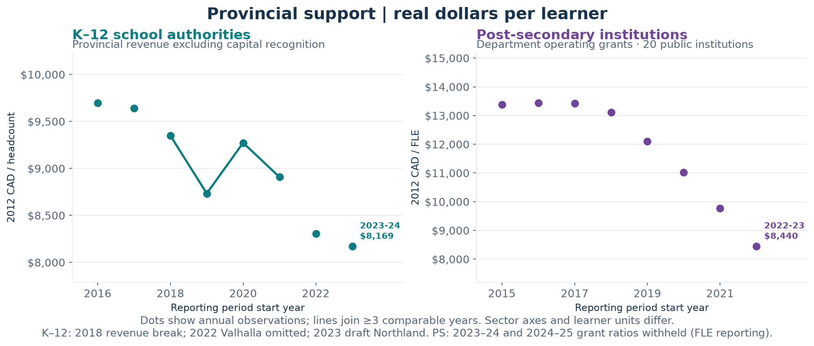
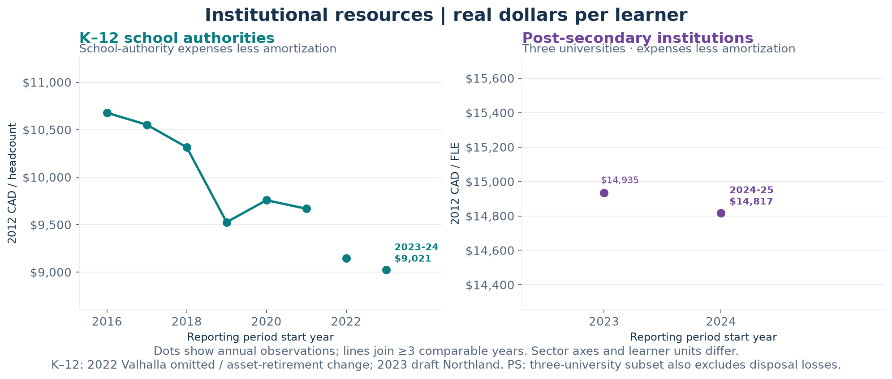
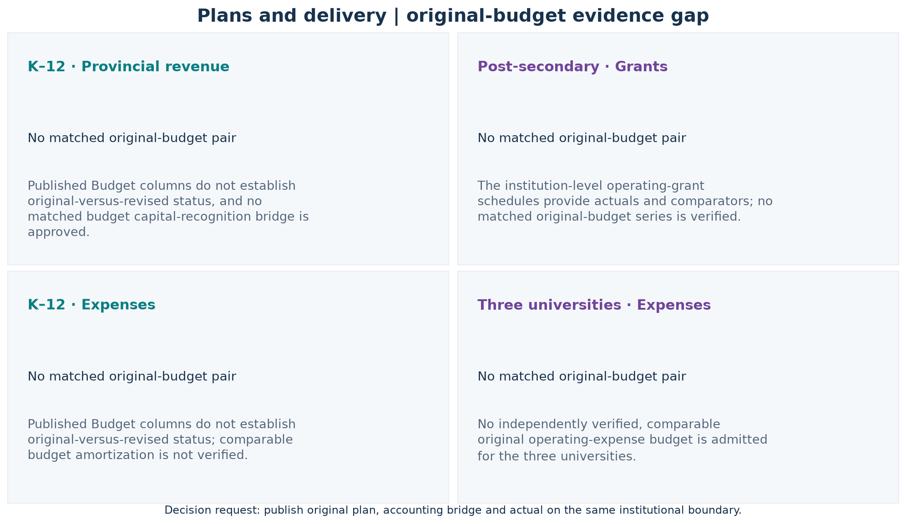

# Alberta education: resources, learners and delivery

**Evidence brief · September 2026 source refresh · constant 2012 Canadian dollars**

> **What changed.** For the verified three-university subset, real expenses per FLE were 0.8% lower in 2024-25 than 2023-24, while nominal expenses on this definition rose 7.6%. The latest matched K–12 school-authority expense level is **$9,021 per headcount (2023-24)**. **Why it matters.** School-authority revenue, institutional expense and provincial budgets answer different questions; enrolment reporting and accounting breaks constrain trend readings. **Decision supported.** Review the dated periods shown below and commission a common original-budget bridge before assessing plan delivery. These data identify questions for investigation; they do not establish funding adequacy or causation.

## 1 · Provincial support

**Finding.** The latest supported K–12 recognized provincial revenue excluding capital recognition is **$8,169 per headcount (2023-24)**. The latest supported post-secondary departmental operating grants to 20 public institutions are **$8,440 per FLE (2022-23)**. These are dated levels, not a cross-sector funding rank. The latest 20-institution post-secondary ratios are withheld where the FLE source flags reporting problems.

**Policy question.** Which changes in each *comparable* reporting segment warrant a source-level review of grant decisions and learner demand?

**Limits.** K–12 revenue includes reported provincial pension support and excludes directly collected opted-out-board property tax; it is not cash grants or total support. Its classification changes in 2018–19, 2022–23 omits Valhalla, and the 2023–24 compilation includes draft Northland reporting. The post-secondary numerator includes all department operating-grant programs, not just base grants; historical program boundaries are not fully harmonized. Fiscal and academic periods only approximately align. Earlier FLE years may also reflect the thesis-reporting issue flagged later; its size is unknown. [Download observations](budget_data/per_learner.csv) · [Coverage and reasons](budget_data/coverage.csv) · [Methods](docs/METHODOLOGY.md)

## 2 · Institutional resources

**Finding.** The latest matched school-authority expense excluding amortization is **$9,021 per headcount (2023-24)**. For the defined three undergraduate universities—Alberta University of the Arts, MacEwan and Mount Royal—the latest expense excluding amortization and identified capital disposal losses is **$14,817 per FLE (2024-25)**. For the verified three-university subset, real expenses per FLE were 0.8% lower in 2024-25 than 2023-24, while nominal expenses on this definition rose 7.6%. This subset does not describe the whole post-secondary system.

**Policy question.** Do changes in expenses per learner reflect staffing, facilities, pensions, research, ancillary activity or other functions, and how do institutions explain them?

**Limits.** Both expense measures include activity beyond classroom instruction. The three-university financial and FLE periods do not have identical month boundaries. Neither expense series is interchangeable with its provincial grant series. [Download observations](budget_data/per_learner.csv) · [Definitions](data/series.json) · [Methods](docs/METHODOLOGY.md)

## 3 · Plans and delivery

**Finding.** No verified original-budget/actual pair is available on these boundaries. Reported budget columns and later forecasts cannot establish original plans for the selected measures.

**Policy question.** Can each ministry or institution publish the adopted original budget, subsequent revisions and a reconciliation to the actual on the *same* recipient and accounting boundary? That would permit signed variance bars in the next edition.

**Limits.** No zero variance is implied by missing bars. The missing original-plan evidence prevents a defensible delivery assessment. [Matched-pair table](budget_data/delivery.csv) · [Source manifest](data/sources.json) · [Budget rules](docs/METHODOLOGY.md)

## Demand and evidence coverage

| Evidence line | Latest matched learners | Matched years | Latest real amount per learner |
|---|---|---:|---|
| K–12 · provincial revenue | 726,625 headcount (2023-24) | 8 | $8,169 per headcount (2023-24) |
| Post-secondary · departmental grants (20 public) | 184,887 FLE (2022-23) | 8 | $8,440 per FLE (2022-23) |
| K–12 · school-authority expenses | 726,625 headcount (2023-24) | 8 | $9,021 per headcount (2023-24) |
| Post-secondary · three-university expenses | 27,463 FLE (2024-25) | 2 | $14,817 per FLE (2024-25) |

K–12 uses matched September school-authority **headcount**; post-secondary uses approved-program **full-load equivalents (FLE)**. Their units, institutions and periods differ. The 2025–26 K–12 enrolment is preliminary; matched financial actuals end earlier. The 20-institution post-secondary FLE counts for 2023–24 and 2024–25 are retained as reported demand context but excluded from ratios. [Download enrolment](budget_data/demand.csv) · [Coverage grid](budget_data/coverage.csv) · [Population context](budget_data/population.csv)

### Evidence and reproduction

The [K–12 financial-statement index](https://www.alberta.ca/k-12-education-financial-statements) calls its combined statements a “roll-up provincial total”; the [2023–24 source record](data/raw/k12/metadata-2023-2024.json) states “Includes draft reporting for The Northlands School Division”. The [Advanced Education 2024–25 annual report](https://open.alberta.ca/dataset/9c785a4b-e79a-465b-8fa9-322a322f1f15/resource/f0581939-0ba9-4bd8-8290-3148f224ec76/download/ae-annual-report-2024-2025.pdf) says its operating-grant schedule includes funding “from all department programs.” CPI comes from [Statistics Canada Table 18-10-0005-01](https://www150.statcan.gc.ca/t1/tbl1/en/tv.action?pid=1810000501). Original files, hashes and retrieval details are in the [source manifest](data/sources.json); the [data contract](docs/DATA_CONTRACT.md), [methodology](docs/METHODOLOGY.md) and [validation report](docs/VALIDATION.md) explain selection, exclusions and checks.

Install the pinned dependencies with `python -m pip install -r requirements.txt -c constraints.txt`, then rebuild the figures, derived tables and this brief offline with `python generate_all_charts.py`. Run the tests with `python -m unittest discover -v`. Use `--output-dir PATH` for an isolated build. The repository keeps the prior exploratory work in [the archive](archive/README.md).
