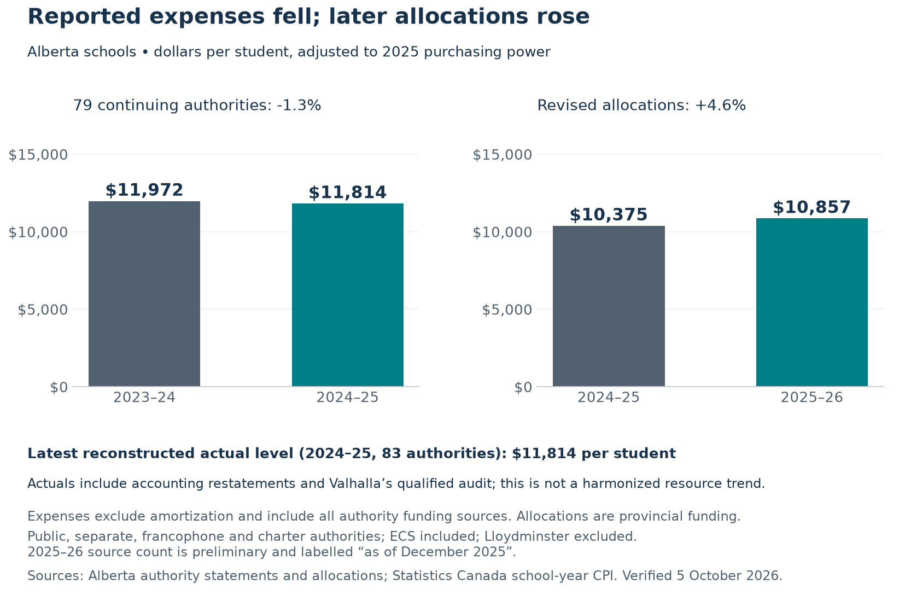
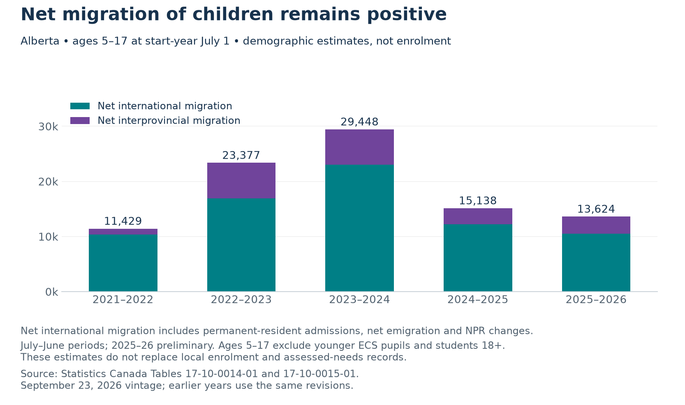
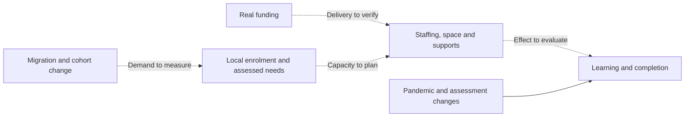

# Alberta schools: reported real expenses fell; newer funding rose

**For 79 continuing authorities, reported expenses excluding amortization per pupil fell 1.3% after inflation from 2023–24 to 2024–25. Revised allocations per pupil rose 4.6% after inflation from 2024–25 to 2025–26.** Accounting changes limit the spending comparison; allocations are a different measure.

## Spending and funding

Amounts are Canadian dollars. This report covers schools; [methods and broader education context](docs/CURRENT_METHODS.md) retain post-secondary totals, childcare exclusions and operating/capital boundaries.



The comparison uses statement comparatives and matched September headcounts for 79 authorities covering **99.9%** of the 2024–25 pupils in our public system scope. Restatements and Valhalla's qualified fundraising audit mean it measures reported expenses, not a fully harmonized change in classroom resources. [Independent audit review](docs/research/refresh-finance/comparative79_review.md).

All 83 matched 2024–25 statements separately yield **$11,814 per pupil in 2025 dollars**. These are researcher aggregations. The older like-for-like 2016–22 decline was 12.4%; accounting and coverage breaks prevent joining the series.

Expenses include all authority revenue sources; allocations are provincial funding. Annual scope includes public, separate, francophone and charter authorities plus Early Childhood Services, excluding Lloydminster. The allocation comparison uses **preliminary 2025–26 enrolment, labelled “as of December 2025”**, versus final September 2024 enrolment, with four new charters. CPI measures general purchasing power, not school input costs.

## Outcomes are mixed; service capacity needs checking

The [December 2025 official update](https://open.alberta.ca/dataset/8d78df56-9979-457c-9ec2-26e87bd922ed/resource/8130ef49-31fd-473b-affa-9b5fb81f1726/download/ecc-annual-report-update-2024-2025.pdf) extends assessment evidence to 2024–25:

| Acceptable-standard attainment | 2023–24 → 2024–25 | Change |
|---|---|---:|
| Grade 9 mathematics, enrolled denominator | 52.7% → 51.7% | -1.0 percentage points |
| Diploma mathematics, exam-writer denominator | 73.5% → 76.0% | +2.5 percentage points |

Grade 9 mathematics participation rose 84.9% → 85.3%. Regular Mathematics 9 results also weakened among exam writers. Different cohorts and denominators limit comparison; these outcomes predate the 2025–26 allocation increase. [Completion and assessment definitions](docs/research/refresh-outcomes/FINDINGS.md).

A newer classroom snapshot shows **21.6% of included Grade 7–9 class records exceeded 30 pupils** as of 24 November 2025. These selected self-reported public/separate/francophone groups exclude specified programs; pupils repeat across records. This is a capacity signal, not a unique-pupil count or spending effect.

## Immigration and migration change the demand picture



In **July 2025–June 2026**, Alberta gained an estimated **13,624 net migrants aged 5–17**: 10,479 internationally and 3,145 from other provinces. The immigrant component counted 8,374 permanent-resident admissions, including status changes rather than only new arrivals.

All-age net non-permanent-resident change was negative, yet it remained **+3,408 for ages 5–17**. An overall population slowdown therefore cannot substitute for school-age forecasts. Age-at-July 1 estimates omit younger ECS pupils and students 18+, and do not measure new enrolment, local settlement or language needs. [Migration evidence and revisions](docs/research/migration/FINDINGS.md).

**The available datasets do not establish that spending or immigration caused these outcome changes.**


```mermaid
flowchart LR
    M[Migration and cohort change] -. Demand to measure .-> N[Local enrolment and assessed needs]
    F[Real funding] -. Delivery to verify .-> S[Staffing, space and supports]
    N -. Capacity to plan .-> S
    S -. Effect to evaluate .-> O[Learning and completion]
    C[Pandemic and assessment changes] --> O
```

## Decisions

- **Ministry and authorities:** audit forecast errors and midyear adjustment timing under the existing 30% current-year/70% projected-year enrolment model. Use local registrations, withdrawals, grade cohorts and assessed needs; separately cost staff and space. Planned 2026–27 allocations grow 6.4%, but missing matched enrolment prevents a per-student estimate.
- **Authorities:** prioritize numeracy and timely language/learning support according to assessed need. Track enrolment-to-assessment waits, delivered support hours, attendance and learning progress. Compare baseline-adjusted progress and delivered supports with comparable schools and prior trends; a full-year review is an initial checkpoint before scaling. Do not treat immigrant status as a learning deficit.
- **Reviewers:** independently reconcile source definitions and arithmetic, challenge causal claims, revise, and recheck. The [recorded critique loop](docs/reviews/extended-policy-review.md) identifies remaining uncertainty rather than promising a funding payoff.

## How we obtained and checked the evidence

**Verified 5 October 2026:** we enabled narrowly scoped official-domain access, checked live catalogues, downloaded the latest located statements/update/classroom files, and independently validated extraction, coverage, CPI periods and migration identities. Migration uses a consistent **23 September 2026 revised vintage**; mixing it with older population snapshots would give incorrect results. Large downloads stay in caches; bounded extracts, checksums and reproducible scripts preserve the evidence. [Source ledger and resource record](docs/research/extended-session-log.md).

Allocations and August 2026 CPI were unchanged on live recheck. No 2025–26 ministry annual report or assessment release was located in checked official listings. The evidence is latest verified, not a guarantee of completeness. The PDF remains the September snapshot; **this README is the updated report**.

```bash
source .venv/bin/activate
export XDG_CACHE_HOME="$PWD/.venv/cache" MPLCONFIGDIR="$PWD/.venv/matplotlib"
python -m unittest discover -v
python generate_all_charts.py --output-dir validation-output
```
