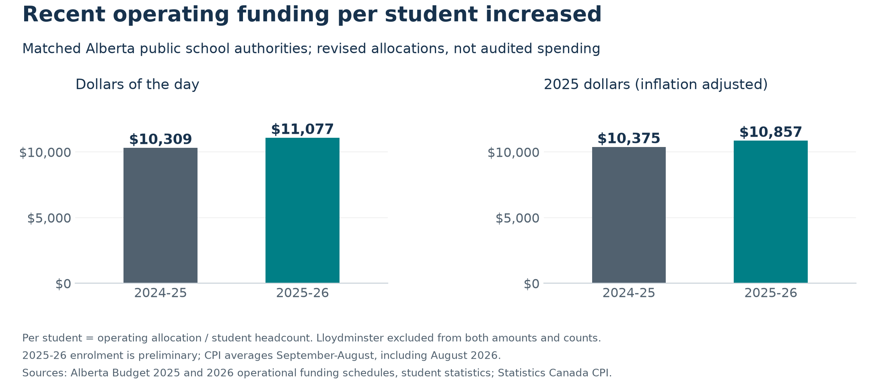
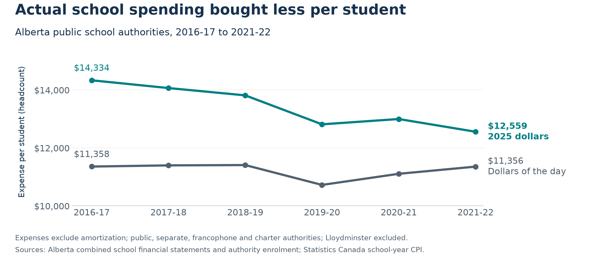

# Alberta education funding per student

**Evidence updated 20 September 2026. All amounts are Canadian dollars.**

**Recent school funding increased per student, even after rising prices are taken into account.** Earlier actual spending bought less per student. These findings compare funding in 2024–26 and spending in 2016–22 separately.

**Per-student figures show whether funding keeps pace with enrolment.** They divide a funding or spending total by the number of students in the same schools.

[Read the concise report](reports/alberta_education_brief.pdf) · [Download the data](budget_data/education_evidence.csv) · [Methods and sources](docs/CURRENT_METHODS.md)

## Recent funding increased

**Recent funding grew faster than prices.** Funding allocated per student rose from **$10,309 in 2024–25** to **$11,077 in 2025–26**. That is **7.4% growth in dollars**, or **4.6% after inflation**.

**Funding also grew faster than student numbers.** For the same group of school authorities, funding increased from **$7.717 billion to $8.362 billion**. Student numbers grew by **0.85%**, from 748,521 to 754,880.



**These figures show allocated funding, including changes made during the year.** The source calls these changes “in-year adjustments”. Audited spending measures what schools actually spent. The 2025–26 student count is preliminary.

**The funding and student counts cover the same school systems.** Public, separate, francophone and charter authorities are included, along with Early Childhood Services. Both Lloydminster boards are excluded from each side of the calculation.

## Earlier spending lost purchasing power

**Earlier spending per student barely changed before inflation.** School authorities spent **$11,358 per student in 2016–17** and **$11,356 in 2021–22**.

**Rising prices reduced what that spending could buy.** In 2025 dollars, spending fell from **$14,334 to $12,559 per student**, a **12.4% decline**. Total spending rose from $7.402 billion to $7.719 billion while enrolment increased.



**School expenses cover more than teaching.** This measure includes instruction, transport, facilities and administration. It excludes amortization, the accounting charge for using long-lived assets such as buildings.

**The 2023–24 financial report puts spending at $11,647 per student, or $8.463 billion overall.** It is shown separately because later reports changed their accounting and which authorities they included.

**Calgary's funding remained below the level needed to preserve purchasing power.** The Calgary Board of Education reports adjusted funding of **$9,622 per student in 2024–25**, versus its inflation-adjusted benchmark of **$11,048**. That **12.9% gap** describes Calgary only.

## What the 2026–27 plan provides

**Planned school funding rises 6.4% in 2026–27 for the authorities being compared.** Their allocation is **$8.896 billion**. Including Lloydminster, the published public-school total is **$8.943 billion**.

**Student growth and rising costs will determine what the increase buys.** Their combined effect must not exceed the funding increase to preserve purchasing power per student. These are planned allocations, not completed spending.

## Overall education spending

**Alberta spent $17.197 billion on education in 2024–25.** This total covers schools and post-secondary education. It equals approximately **$3,540 per Alberta resident**.

**Budget 2026 plans $19.388 billion in education spending.** That equals **$3,834 per resident** using the April 1, 2026 population. This is a budget amount, while the 2024–25 figure is actual spending.

**Per-resident spending shows the scale of the whole education system.** It includes spending funded by institutions' own revenue and excludes childcare. School grants are already within this broader measure and must not be added again.

**The 2026–27 operating budget provides $10.755 billion for schools and $7.110 billion for Advanced Education.** These cover ongoing services. The ministry's separate **$2.110 billion childcare component** is excluded from school comparisons.

## What to do next

**Protect what each student's funding can buy.** Adjust annual operating funding for enrolment growth and costs. Cost additional learning supports separately, then track teachers, education assistants and services alongside dollars.

**An extra $100 per student requires about $75.5 million annually** for the 754,880 students in this comparison. Distinguish ongoing funding from temporary additions when planning improvements.

## Sources and reproduction

**The calculations use official funding, enrolment and financial records.** Sources include [Alberta operating allocations](https://www.alberta.ca/system/files/ecc-projected-operational-funding-school-authorities.pdf), [student statistics](https://www.alberta.ca/student-population-statistics) and Statistics Canada. See the [methodology](docs/CURRENT_METHODS.md) and [source manifest](data/latest/source_manifest.json) for definitions and source details.

**Using 2025 dollars makes purchasing power comparable across years.** The adjustment uses the Consumer Price Index, a measure of changing prices, averaged over each September–August school year. Price data extends through August 2026.

**Older supporting tables use a different price reference.** They retain their documented 2012-dollar convention and should not be directly compared with the README's 2025-dollar figures.

```bash
python -m pip install -r requirements.txt -c constraints.txt
python generate_all_charts.py
python -m unittest discover -v
```

**The README, charts and evidence tables can be rebuilt offline** using the commands above. Use `--output-dir PATH` to save a separate build. The PDF remains the reviewed September 2026 snapshot.
