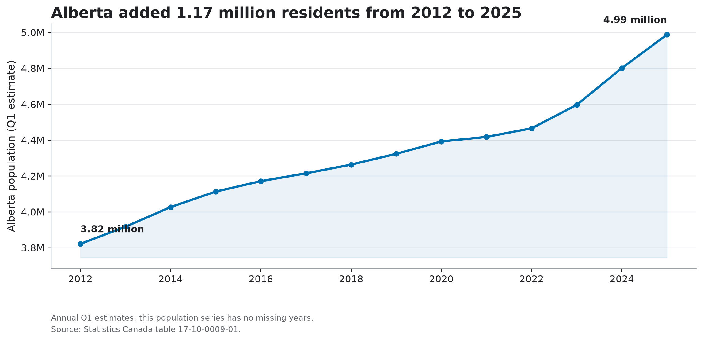
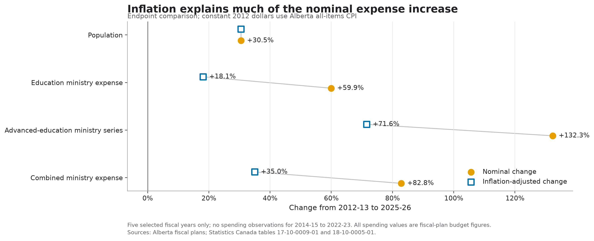
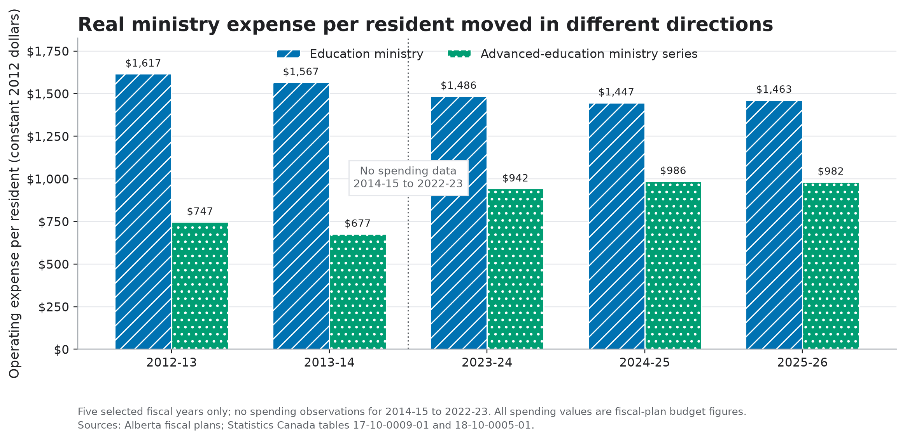
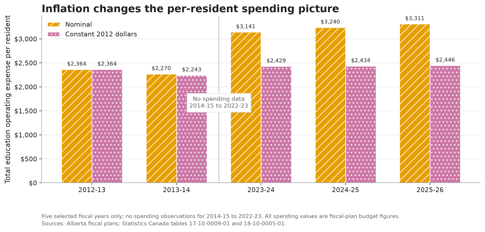

# Alberta Population and Education Spending

This project compares Alberta's population with operating expenses reported by the provincial ministries responsible for school and advanced education. It asks a focused question: between 2012–13 and 2025–26, did those ministry expenses keep pace with population growth and inflation?

The spending dataset contains five selected fiscal years: 2012–13, 2013–14, 2023–24, 2024–25, and 2025–26. It does **not** contain spending figures for 2014–15 through 2022–23. Because those nine fiscal years are missing, this project supports comparisons between the available observations, especially the first and last years. It does not show a continuous spending trend.

## Main findings

Between the first and last observations:

- Alberta's population was 30.5% higher.
- Combined ministry operating expense was 82.8% higher in nominal dollars and 35.0% higher after adjustment for Alberta CPI.
- Real Education ministry operating expense per Alberta resident was 9.5% lower.
- Real expense in the advanced-education ministry series per resident was 31.5% higher.
- Combined real ministry operating expense per resident was 3.5% higher.

These results describe a comparison of two endpoints. They do not show when changes happened during the missing years. The ministry responsible for advanced education also changed name and scope, so that series is not a like-for-like measure of post-secondary funding.

| Measure | 2012–13 | 2025–26 | Change |
|---|---:|---:|---:|
| Population | 3,822,425 | 4,988,181 | +30.5% |
| Education ministry expense | $6.179B | $9.883B | +59.9% nominal |
| Advanced-education ministry series | $2.856B | $6.635B | +132.3% nominal |
| Combined ministry expense | $9.035B | $16.518B | +82.8% nominal |
| Real Education ministry expense per resident | $1,617 | $1,463 | −9.5% |
| Real advanced-education ministry expense per resident | $747 | $982 | +31.5% |
| Real combined expense per resident | $2,364 | $2,446 | +3.5% |

Real-dollar figures are expressed in constant 2012 dollars. All spending values are budget-plan figures, not audited final expenses.

## Key charts

### Alberta's population increased across the study period



The population series is complete from 2012 to 2025. Alberta had about 1.17 million more residents in Q1 2025 than in Q1 2012. This population chart provides context for the five available spending observations.

### Inflation explains much of the nominal spending increase



Nominal spending means the dollar amount reported for each year. Real spending adjusts those amounts using Alberta's All-items Consumer Price Index. Total operating expense was 82.8% higher in nominal terms at the 2025–26 endpoint, but 35.0% higher in constant 2012 dollars. The real increase was close to the 30.5% increase in population.

### The two ministry series differ after both adjustments



Dividing real operating expense by population accounts for both inflation and the number of Alberta residents. On this measure, the 2025–26 Education ministry endpoint was below the 2012–13 level, while the advanced-education ministry endpoint was above it. These figures use the total provincial population; they are not measures of spending per student. Changes in ministry responsibilities also limit the comparison.

### Total expense per resident was nearly unchanged in real terms



Nominal total operating expense per resident was 40.1% higher at the final endpoint. After the CPI adjustment, it was 3.5% higher. This difference shows why nominal and real values should be read together.

## Data and method

The analysis combines three types of data:

- Quarterly population estimates from [Statistics Canada Table 17-10-0009-01](https://www150.statcan.gc.ca/t1/tbl1/en/tv.action?pid=1710000901).
- Ministry operating expense figures from [Government of Alberta budget documents](https://open.alberta.ca/publications/budget).
- Alberta All-items CPI annual averages from [Statistics Canada Table 18-10-0005-01](https://www150.statcan.gc.ca/t1/tbl1/en/tv.action?pid=1810000501).

For each spending observation, the analysis uses Alberta's Q1 population from the calendar year in which the fiscal year starts. For example, 2025–26 is paired with the Q1 2025 population.

The `K12_M` field is the operating expense of the ministry responsible for Education. The `PostSec_M` field is a shorthand name for the advanced-education ministry series. That ministry was called Advanced Education and Technology in 2012–13, Enterprise and Advanced Education in 2013–14, and Advanced Education in the later observations. The two ministry totals are added for the combined measure. Capital expenses are not included. Each row in [`spending_data.csv`](spending_data.csv) includes the exact ministry names and an official source link.

The inflation adjustment uses 2012 as the base:

```text
CPI deflator = CPI for selected year / CPI for 2012
Real operating expense = nominal operating expense / CPI deflator
Real expense per resident = real operating expense / population
```

The analysis uses annual CPI for the starting calendar year of each fiscal year. The integrated data, including the calculated nominal, real, and per-resident values, are saved in [`budget_data/population_vs_spending.csv`](budget_data/population_vs_spending.csv).

## Limits

This analysis has several important limits:

1. **Nine fiscal years are missing.** There are no spending observations for 2014–15 through 2022–23. Lines should not be read as evidence of a steady change across that gap.
2. **The figures come from budget plans.** They may differ from audited actual expenses.
3. **The scope is operating expense.** Capital spending, including construction and major infrastructure, is outside the analysis.
4. **Residents are not students.** Total population is useful for comparing broad fiscal pressure, but enrollment would be the better denominator for a per-student analysis.
5. **CPI is a general price measure.** Education costs may change differently from the Alberta All-items CPI.
6. **Fiscal years and calendar years do not match exactly.** Using Q1 population and annual CPI from the starting calendar year is a consistent approximation, but a fiscal-year average would be more precise.
7. **Ministry responsibilities changed.** The advanced-education series is not a consistent post-secondary program total. Its endpoint change may reflect changes in ministry scope as well as spending.

The strongest next step would be to add audited Alberta Public Accounts data for every missing year. Enrollment data could then support a separate per-student comparison.

## Run the project

Python 3.12 is recommended.

```bash
python -m pip install -r requirements.txt
python generate_all_charts.py
```

The chart script reads `spending_data.csv`, `alberta_yoy_growth.csv`, and `cpi_data.csv`. It writes the integrated dataset to `budget_data/population_vs_spending.csv` and regenerates every chart shown in this README in both PNG and SVG formats.

Run the calculation checks with:

```bash
python -m unittest test_generate_all_charts.py
```

The population notebooks require the Statistics Canada population table used by the original analysis. They also use optional packages such as `requests` and `scikit-learn`, which are not part of the core chart requirements. Run the notebooks if you want to rebuild the population-specific charts:

- `Population Predictions Canada 2025.ipynb` prepares the population analysis.
- `Alberta Population vs Education Spending.ipynb` documents the earlier integrated workflow.

## Project files

| Path | Purpose |
|---|---|
| `generate_all_charts.py` | Builds the integrated data and spending charts |
| `spending_data.csv` | Five selected ministry-expense observations with exact source links |
| `alberta_yoy_growth.csv` | Annual Q1 Alberta population observations |
| `cpi_data.csv` | Alberta CPI observations with source notes |
| `test_generate_all_charts.py` | Calculation and input-validation checks |
| `budget_data/population_vs_spending.csv` | Calculated analysis dataset |
| `plots/` | Generated charts |
| `Population Predictions Canada 2025.ipynb` | Population analysis notebook |
| `Alberta Population vs Education Spending.ipynb` | Original integration notebook |

This repository presents a descriptive comparison. It does not test whether population growth caused changes in education spending.
